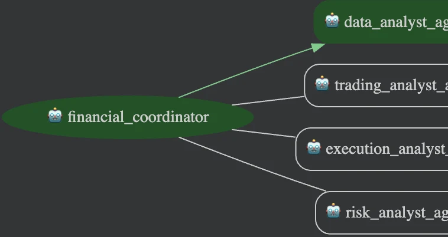

# Financial Advisor (Go)

A team of AI agents that helps a human financial advisor. A coordinator agent
walks the user through four steps and calls a specialist agent for each one:

1. **Data analyst** builds a current market analysis report for a stock ticker,
   using the built-in Google Search tool.
2. **Trading analyst** proposes at least five trading strategies that fit the
   market analysis, the user's risk attitude, and their investment period.
3. **Execution analyst** writes a detailed plan for entering, holding, scaling,
   and exiting the chosen strategies.
4. **Risk analyst** evaluates the risk of the whole plan against the user's
   risk attitude and investment period.

This is the [ADK for Go](https://github.com/google/adk-go) port of
[`contrib/python/financial-advisor`](../../python/financial-advisor). The
agent graph is the same, and so are the prompts apart from small fixes: typos,
the subagent names the coordinator calls, and one shared copy of the legal
disclaimer.



## How it works

Each specialist is an `llmagent` wrapped in an `agenttool`, so the
coordinator calls it like any other tool and gets its answer back as the tool
result. Each agent also sets an `OutputKey`, which saves its final answer in
session state (for example `market_data_analysis_output`).

| File | What it holds |
| --- | --- |
| `main.go` | Loads `.env`, builds the agent, and hands it to the ADK launcher |
| `agent.go` | The coordinator and the agent tools that wrap the specialists |
| `data_analyst.go` | The data analyst, the only agent with a tool (`geminitool.GoogleSearch`) |
| `trading_analyst.go`, `execution_analyst.go`, `risk_analyst.go` | The other three specialists |
| `disclaimer.go` | The disclaimer those three specialists include in their output |
| `model.go` | Reads `.env` and creates the Gemini client on first use |

**Legal disclaimer.** The information and trading strategy outlines provided
by this tool are generated by an AI model and are for educational and
informational purposes only. They do not constitute financial advice,
investment recommendations, endorsements, or offers to buy or sell any
securities. You should conduct your own research and consult a qualified
independent financial advisor before making any investment decision.

## Prerequisites

- Go 1.26 or later
- Either a Google Cloud project with the Vertex AI API enabled, or a
  [Gemini API key](https://aistudio.google.com/apikey)

## Configuration

Copy the example file and fill it in:

```bash
cp .env.example .env
```

To use Vertex AI, set `GOOGLE_CLOUD_PROJECT` and authenticate:

```bash
gcloud auth application-default login
```

To use the Gemini API instead, set `GOOGLE_GENAI_USE_VERTEXAI=False` and
`GOOGLE_API_KEY`. Real environment variables take precedence over `.env`.

## Running the agent

Chat with the agent in the terminal:

```bash
go run .
```

Or start the ADK dev UI and open http://localhost:8080 in a browser:

```bash
go run . web api webui
```

Start with `hi`. The coordinator introduces itself, shows the disclaimer, and
asks for a ticker. Send `show me the detailed result as markdown` at any step
to see a specialist's full output.

## Testing

```bash
go test ./...
```

`runnability_test.go` builds the launcher configuration `main` serves and
checks that the ADK REST API lists `financial_coordinator` at `/list-apps`.
`agent_test.go` checks that the coordinator gets the four specialist tools.
Neither calls the model, so they need no credentials.

## Deployment

The `Dockerfile` builds a static binary and serves the ADK REST API and dev UI
on port 8080. To deploy it to Cloud Run:

```bash
gcloud run deploy financial-advisor \
  --source . \
  --region us-central1 \
  --set-env-vars GOOGLE_GENAI_USE_VERTEXAI=True,GOOGLE_CLOUD_PROJECT=<your-project-id>,GOOGLE_CLOUD_LOCATION=global
```

The Cloud Run service account needs the Vertex AI User role
(`roles/aiplatform.user`). The dev UI expects the API at
`http://localhost:8080/api`, so open it through a local proxy:

```bash
gcloud run services proxy financial-advisor --region us-central1 --port 8080
```
